```mermaid
erDiagram
    %% ==========================================
    %% TENANT & IDENTITY MANAGEMENT
    %% ==========================================
    
    TENANT {
        uuid id PK
        string name
        string slug UK
        enum status "DRAFT|ACTIVE|SUSPENDED"
        json settings
        json opening_hours
        int onboarding_step
        timestamp created_at
        timestamp updated_at
    }

    USER {
        uuid id PK
        string email UK
        string password_hash
        string full_name
        string avatar_url
        enum role "OWNER|STAFF|KITCHEN"
        enum status "ACTIVE|INACTIVE|PENDING|LOCKED"
        uuid tenant_id FK
        timestamp created_at
        timestamp updated_at
    }

    USER_SESSION {
        uuid id PK
        uuid user_id FK
        string refresh_token_hash
        string device_info
        timestamp last_used_at
        timestamp expires_at
        timestamp created_at
    }

    STAFF_INVITATION {
        uuid id PK
        uuid tenant_id FK
        string email
        enum role "OWNER|STAFF|KITCHEN"
        string token UK
        timestamp expires_at
        timestamp used_at
        string invited_by
        timestamp created_at
    }

    TENANT_PAYMENT_CONFIG {
        uuid id PK
        uuid tenant_id FK "UK"
        boolean sepay_enabled
        string sepay_api_key "encrypted"
        string sepay_account_no
        string sepay_account_name
        string sepay_bank_code
        string webhook_secret
        boolean webhook_enabled
        timestamp created_at
        timestamp updated_at
    }

    %% ==========================================
    %% MENU MANAGEMENT
    %% ==========================================
    
    MENU_CATEGORY {
        uuid id PK
        uuid tenant_id FK
        string name
        string description
        int display_order
        boolean active
        timestamp created_at
        timestamp updated_at
    }

    MENU_ITEM {
        uuid id PK
        uuid tenant_id FK
        uuid category_id FK
        string name
        string description
        decimal price
        string image_url "deprecated"
        enum status "DRAFT|PUBLISHED|ARCHIVED"
        boolean available
        int display_order
        int preparation_time
        boolean chef_recommended
        int popularity
        uuid primary_photo_id
        json tags
        json allergens
        timestamp created_at
        timestamp updated_at
        timestamp published_at
    }

    MENU_ITEM_PHOTO {
        uuid id PK
        uuid menu_item_id FK
        string url
        string filename
        string mime_type
        int size
        int width
        int height
        int display_order
        boolean is_primary
        timestamp created_at
        timestamp updated_at
    }

    MODIFIER_GROUP {
        uuid id PK
        uuid tenant_id FK
        string name
        string description
        enum type "SINGLE_CHOICE|MULTI_CHOICE"
        boolean required
        int min_choices
        int max_choices
        int display_order
        boolean active
        timestamp created_at
        timestamp updated_at
    }

    MODIFIER_OPTION {
        uuid id PK
        uuid group_id FK
        string name
        decimal price_delta
        int display_order
        boolean active
        timestamp created_at
        timestamp updated_at
    }

    MENU_ITEM_MODIFIER {
        uuid menu_item_id FK "PK"
        uuid modifier_group_id FK "PK"
        int display_order
        timestamp created_at
    }

    %% ==========================================
    %% TABLE & SESSION MANAGEMENT
    %% ==========================================
    
    TABLE {
        uuid id PK
        uuid tenant_id FK
        string table_number
        int capacity
        string location
        string description
        enum status "AVAILABLE|OCCUPIED|RESERVED|INACTIVE"
        string qr_token UK
        string qr_token_hash
        timestamp qr_token_created_at
        timestamp qr_invalidated_at
        string current_session_id
        int display_order
        boolean active
        timestamp created_at
        timestamp updated_at
    }

    TABLE_SESSION {
        uuid id PK
        uuid table_id FK
        uuid tenant_id FK
        timestamp scanned_at
        boolean active
        timestamp cleared_at
        string cleared_by
        timestamp created_at
        timestamp updated_at
    }

    %% ==========================================
    %% CART MANAGEMENT
    %% ==========================================
    
    CART {
        uuid id PK
        uuid tenant_id FK
        uuid table_id FK
        string session_id
        timestamp expires_at
        timestamp created_at
        timestamp updated_at
    }

    CART_ITEM {
        uuid id PK
        uuid cart_id FK
        uuid menu_item_id FK
        int quantity
        decimal unit_price
        string notes
        json modifiers
        timestamp created_at
        timestamp updated_at
    }

    %% ==========================================
    %% ORDER MANAGEMENT
    %% ==========================================
    
    ORDER {
        uuid id PK
        string order_number
        uuid tenant_id FK
        uuid table_id FK
        string session_id
        string customer_name
        string customer_notes
        enum status "PENDING|RECEIVED|PREPARING|READY|SERVED|COMPLETED|PAID|CANCELLED"
        enum priority "NORMAL|HIGH|URGENT"
        decimal subtotal
        decimal tax
        decimal service_charge
        decimal tip
        decimal total
        int estimated_prep_time
        int actual_prep_time
        enum payment_method "BILL_TO_TABLE|SEPAY_QR|CARD_ONLINE|CASH"
        enum payment_status "PENDING|PROCESSING|COMPLETED|FAILED|REFUNDED"
        timestamp paid_at
        uuid bill_id FK
        timestamp created_at
        timestamp updated_at
        timestamp received_at
        timestamp preparing_at
        timestamp ready_at
        timestamp served_at
        timestamp completed_at
    }

    ORDER_ITEM {
        uuid id PK
        uuid order_id FK
        uuid menu_item_id FK
        string name
        decimal price
        int quantity
        json modifiers
        decimal item_total
        string notes
        boolean prepared
        timestamp prepared_at
        timestamp created_at
        timestamp updated_at
    }

    ORDER_STATUS_HISTORY {
        uuid id PK
        uuid order_id FK
        enum status "PENDING|RECEIVED|PREPARING|READY|SERVED|COMPLETED|PAID|CANCELLED"
        string notes
        string changed_by
        timestamp created_at
    }

    %% ==========================================
    %% PAYMENT MANAGEMENT
    %% ==========================================
    
    PAYMENT {
        uuid id PK
        uuid order_id FK "UK optional"
        uuid tenant_id FK
        enum method "BILL_TO_TABLE|SEPAY_QR|CARD_ONLINE|CASH"
        enum status "PENDING|PROCESSING|COMPLETED|FAILED|REFUNDED"
        decimal amount
        string currency "VND"
        string transaction_id
        string bank_code
        string account_number
        string qr_content
        string deep_link
        string transfer_content
        json provider_data
        string failure_reason
        timestamp paid_at
        timestamp refunded_at
        timestamp expires_at
        timestamp created_at
        timestamp updated_at
    }

    %% ==========================================
    %% BILLING
    %% ==========================================
    
    BILL {
        uuid id PK
        string bill_number UK
        uuid tenant_id FK
        uuid table_id FK
        string session_id
        decimal subtotal
        decimal discount
        decimal tip
        decimal service_charge
        decimal tax
        decimal total
        enum payment_method "BILL_TO_TABLE|SEPAY_QR|CARD_ONLINE|CASH"
        enum payment_status "PENDING|PROCESSING|COMPLETED|FAILED|REFUNDED"
        timestamp paid_at
        string notes
        timestamp created_at
        timestamp updated_at
    }

    %% ==========================================
    %% SUBSCRIPTION SYSTEM
    %% ==========================================
    
    SUBSCRIPTION_PLAN {
        uuid id PK
        enum tier UK "FREE|BASIC|PREMIUM"
        decimal price_usd
        decimal price_vnd
        int max_tables
        int max_menu_items
        int max_orders_month
        int max_staff
        json features
        string name
        string description
        boolean is_active
        timestamp created_at
        timestamp updated_at
    }

    TENANT_SUBSCRIPTION {
        uuid id PK
        uuid tenant_id FK "UK"
        uuid plan_id FK
        enum status "ACTIVE|EXPIRED|CANCELLED"
        timestamp current_period_start
        timestamp current_period_end
        int orders_this_month
        timestamp usage_reset_at
        string last_payment_id
        timestamp created_at
        timestamp updated_at
    }

    %% ==========================================
    %% PROMOTION SYSTEM
    %% ==========================================
    
    PROMOTION {
        uuid id PK
        uuid tenant_id FK
        string code "UK with tenant_id"
        string description
        enum type "PERCENTAGE|FIXED"
        decimal value
        decimal min_order_value
        decimal max_discount
        int usage_limit
        int usage_count
        timestamp starts_at
        timestamp expires_at
        boolean active
        timestamp created_at
        timestamp updated_at
    }

    %% ==========================================
    %% REVIEW SYSTEM
    %% ==========================================
    
    ITEM_REVIEW {
        uuid id PK
        uuid order_item_id FK "UK"
        string session_id
        uuid tenant_id FK
        int rating "1-5"
        string comment
        timestamp created_at
        timestamp updated_at
    }

    %% ==========================================
    %% RELATIONSHIPS
    %% ==========================================
    
    %% Tenant relationships
    TENANT ||--|{ USER : "owns"
    TENANT ||--|| TENANT_PAYMENT_CONFIG : "has_payment_config"
    TENANT ||--|{ STAFF_INVITATION : "has_invitations"
    TENANT ||--|{ MENU_CATEGORY : "owns_categories"
    TENANT ||--|{ MENU_ITEM : "owns_items"
    TENANT ||--|{ MODIFIER_GROUP : "owns_modifiers"
    TENANT ||--|{ TABLE : "owns_tables"
    TENANT ||--|{ CART : "owns_carts"
    TENANT ||--|{ ORDER : "processes_orders"
    TENANT ||--|{ PAYMENT : "receives_payments"
    TENANT ||--|{ BILL : "generates_bills"
    TENANT ||--|{ PROMOTION : "has_promotions"
    TENANT ||--|| TENANT_SUBSCRIPTION : "has_subscription"

    %% User & Auth relationships
    USER ||--o{ USER_SESSION : "has_sessions"

    %% Menu relationships
    MENU_CATEGORY ||--|{ MENU_ITEM : "contains_items"
    MENU_ITEM ||--|{ MENU_ITEM_PHOTO : "has_photos"
    MENU_ITEM }|--|{ MODIFIER_GROUP : "uses_modifiers_via_junction"
    MENU_ITEM_MODIFIER }|--|| MENU_ITEM : "belongs_to_item"
    MENU_ITEM_MODIFIER }|--|| MODIFIER_GROUP : "belongs_to_group"
    MODIFIER_GROUP ||--|{ MODIFIER_OPTION : "has_options"

    %% Table & Session relationships
    TABLE ||--|{ TABLE_SESSION : "has_sessions"
    TABLE ||--o{ ORDER : "places_orders"
    TABLE ||--o{ CART : "has_carts"
    TABLE ||--o{ BILL : "has_bills"

    %% Cart relationships
    CART ||--|{ CART_ITEM : "contains_items"
    MENU_ITEM ||--o{ CART_ITEM : "in_carts"

    %% Order relationships
    ORDER ||--|{ ORDER_ITEM : "contains_items"
    ORDER ||--|{ ORDER_STATUS_HISTORY : "has_status_history"
    ORDER ||--o| PAYMENT : "has_payment"
    ORDER }o--|| BILL : "grouped_in_bill"
    MENU_ITEM ||--o{ ORDER_ITEM : "ordered_as"

    %% Review relationships
    ORDER_ITEM ||--o| ITEM_REVIEW : "has_review"

    %% Subscription relationships
    SUBSCRIPTION_PLAN ||--|{ TENANT_SUBSCRIPTION : "subscribed_by_tenants"
```

# Database ER Diagram - TKOB_QROrderSystem

> **Source of Truth**: `source/apps/api/prisma/schema.prisma`  
> **Last Updated**: 2026-01-20  
> **Note**: This diagram shows all major entities with key fields. Non-key columns may be simplified for readability.

---

---

## Diagram Legend

**Cardinality:**
- `||--||` : One-to-One
- `||--|{` : One-to-Many
- `}|--|{` : Many-to-Many (via junction table)
- `||--o|` : One-to-Zero-or-One (optional)
- `}o--||` : Many-to-One (optional FK)

**Field Types:**
- `uuid` : UUID v4 primary/foreign keys
- `string` : VARCHAR/TEXT fields
- `enum` : PostgreSQL ENUM types
- `decimal` : DECIMAL(10,2) or DECIMAL(12,0) for money
- `int` : INTEGER fields
- `boolean` : BOOLEAN fields
- `json` : JSONB fields for flexible data
- `timestamp` : TIMESTAMPTZ fields

**Key Annotations:**
- `PK` : Primary Key
- `FK` : Foreign Key
- `UK` : Unique Constraint
- `"deprecated"` : Field still exists but replaced by better solution

---

## Domain Groupings

### 1. Tenant & Identity (AUTH)
- `TENANT` - Restaurant/business entity
- `USER` - Staff/owner accounts
- `USER_SESSION` - Login sessions with refresh tokens
- `STAFF_INVITATION` - Email-based staff onboarding
- `TENANT_PAYMENT_CONFIG` - SePay/payment gateway configuration

### 2. Menu Management (MENU)
- `MENU_CATEGORY` - Menu sections (Appetizers, Mains, etc.)
- `MENU_ITEM` - Dishes/products
- `MENU_ITEM_PHOTO` - Multiple photos per item
- `MODIFIER_GROUP` - Customization groups (Size, Toppings)
- `MODIFIER_OPTION` - Individual choices within groups
- `MENU_ITEM_MODIFIER` - Junction table linking items to modifier groups

### 3. Table & Session Management (TABLES)
- `TABLE` - Physical tables with QR codes
- `TABLE_SESSION` - Customer QR scan sessions (Haidilao-style)

### 4. Shopping Cart (CART)
- `CART` - Session-based shopping cart
- `CART_ITEM` - Items in cart with modifiers

### 5. Order Management (ORDERS)
- `ORDER` - Customer orders
- `ORDER_ITEM` - Line items with modifiers snapshot
- `ORDER_STATUS_HISTORY` - Audit trail for status changes

### 6. Payment & Billing (PAYMENTS)
- `PAYMENT` - Online payment transactions (SePay QR)
- `BILL` - Grouped orders for table closing (Bill-to-Table)

### 7. Subscription System (SUBSCRIPTION)
- `SUBSCRIPTION_PLAN` - FREE/BASIC/PREMIUM tiers
- `TENANT_SUBSCRIPTION` - Tenant's active subscription with usage tracking

### 8. Promotions (PROMOTION)
- `PROMOTION` - Discount codes with usage limits

### 9. Reviews (REVIEWS)
- `ITEM_REVIEW` - Customer ratings (1-5 stars) per order item

---

## Key Design Patterns

### Multi-Tenancy
All major tables have `tenant_id` FK for data isolation. Application-level middleware enforces tenant scoping on all queries.

### Soft Deletes
Tables use `active` boolean or `status` enum instead of hard deletes (e.g., `TABLE.active`, `MENU_ITEM.status`).

### Audit Trails
- `ORDER_STATUS_HISTORY` tracks all order state changes
- Most tables have `created_at` and `updated_at` timestamps
- User actions reference `user_id` or `changed_by`

### JSON Flexibility
- `TENANT.settings` - Restaurant-specific configuration
- `MENU_ITEM.tags` / `allergens` - Flexible metadata
- `ORDER_ITEM.modifiers` - Snapshot of selected modifiers
- `CART_ITEM.modifiers` - Current modifier selections

### Session-Based Cart
Cart is tied to `table_id` and optional `session_id` for anonymous customer ordering.

### Payment Flexibility
- `PAYMENT` table supports multiple providers (SePay QR currently implemented)
- `TENANT_PAYMENT_CONFIG` stores encrypted gateway credentials
- `ORDER.payment_method` enum allows future payment methods (Stripe, etc.)

---

## Simplified Fields

For diagram readability, the following columns are omitted but exist in schema:

**TENANT**: No fields omitted (all key fields shown)

**USER**: No significant fields omitted

**MENU_ITEM**: All fields shown (this is a complex entity)

**TABLE**: All key fields shown

**ORDER**: All key fields shown (complex entity with many timestamps)

**All other tables**: Only non-critical text fields or metadata omitted

---

## Notes

1. **SePay vs Stripe**: Current implementation uses SePay (Vietnam VietQR). `TENANT_PAYMENT_CONFIG` reflects actual schema with `sepay_*` fields. `CARD_ONLINE` payment method enum exists but not integrated.

2. **QR Token Security**: `TABLE.qr_token` is unique globally. `qr_token_hash` stores SHA256 hash for validation. Tokens can be invalidated via `qr_invalidated_at` timestamp.

3. **Bill vs Order**: 
   - `ORDER` = single customer order (items from one checkout)
   - `BILL` = aggregated invoice when closing table session (may include multiple orders)

4. **Modifier Snapshot**: `ORDER_ITEM.modifiers` and `CART_ITEM.modifiers` store JSON snapshots to preserve modifier state even if menu changes.

5. **Subscription Usage Tracking**: `TENANT_SUBSCRIPTION.orders_this_month` is reset monthly via `usage_reset_at` field.

6. **Review Uniqueness**: One review per `ORDER_ITEM` (enforced via unique constraint on `order_item_id`).

---

**Last Schema Sync**: 2026-01-20 from `source/apps/api/prisma/schema.prisma` (796 lines)