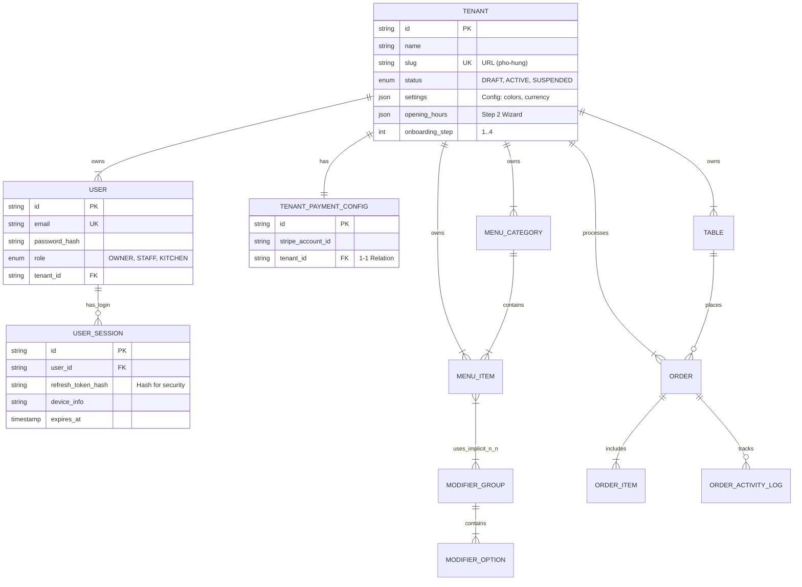

```mermaid
erDiagram
    %% --- GROUP 1: CORE & IAM ---
    TENANT {
        string id PK
        string name
        string slug UK "URL (pho-hung)"
        enum status "DRAFT, ACTIVE, SUSPENDED"
        json settings "Config: colors, currency"
        json opening_hours "Step 2 Wizard"
        int onboarding_step "1..4"
    }

    USER {
        string id PK
        string email UK
        string password_hash
        enum role "OWNER, STAFF, KITCHEN"
        string tenant_id FK
    }

    USER_SESSION {
        string id PK
        string user_id FK
        string refresh_token_hash "Hash for security"
        string device_info
        timestamp expires_at
    }

    TENANT_PAYMENT_CONFIG {
        string id PK
        string stripe_account_id
        string tenant_id FK "1-1 Relation"
    }

    %% RELATIONS
    TENANT ||--|{ USER : owns
    TENANT ||--|{ TABLE : owns
    TENANT ||--|{ MENU_CATEGORY : owns
    TENANT ||--|{ MENU_ITEM : owns
    TENANT ||--|{ ORDER : processes
    TENANT ||--|| TENANT_PAYMENT_CONFIG : has
    
    USER ||--o{ USER_SESSION : has_login
    
    MENU_CATEGORY ||--|{ MENU_ITEM : contains
    MENU_ITEM }|--|{ MODIFIER_GROUP : uses_implicit_n_n
    MODIFIER_GROUP ||--|{ MODIFIER_OPTION : contains
    
    TABLE ||--o{ ORDER : places
    ORDER ||--|{ ORDER_ITEM : includes
    ORDER ||--o{ ORDER_ACTIVITY_LOG : tracks
```