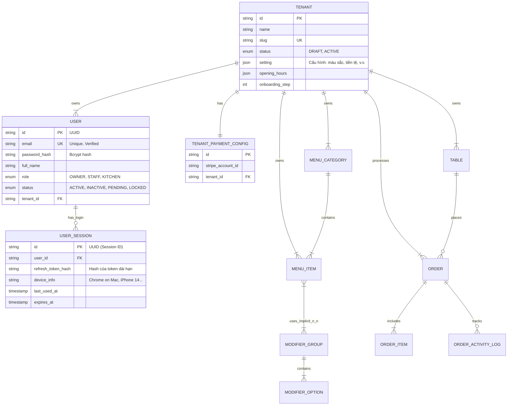

```mermaid
erDiagram
    %% --- IDENTITY & AUTH ---
    USER {
        string id PK "UUID"
        string email UK "Unique, Verified"
        string password_hash "Bcrypt hash"
        string full_name
        enum role "OWNER, STAFF, KITCHEN"
        enum status "ACTIVE, INACTIVE, PENDING, LOCKED"
        string tenant_id FK
    }

    %% --- SESSION MANAGEMENT ---
    USER_SESSION {
        string id PK "UUID (Session ID)"
        string user_id FK
        string refresh_token_hash "Hash của token dài hạn"
        string device_info "Chrome on Mac, iPhone 14..."
        timestamp last_used_at
        timestamp expires_at
    }

    %% --- TENANT CONTEXT ---
    TENANT {
        string id PK
        string name
        string slug UK
        enum status "DRAFT, ACTIVE"
        json setting "Cấu hình: màu sắc, tiền tệ, v.v."
        json opening_hours
        int onboarding_step
    }

    %% --- SECURE PAYMENT ---
    TENANT_PAYMENT_CONFIG {
        string id PK
        string stripe_account_id
        string tenant_id FK
    }

    %% RELATIONS
    TENANT ||--|{ USER : owns
    TENANT ||--|| TENANT_PAYMENT_CONFIG : has
    USER ||--o{ USER_SESSION : has_login
    
    TENANT ||--|{ TABLE : owns
    TENANT ||--|{ MENU_CATEGORY : owns
    TENANT ||--|{ MENU_ITEM : owns
    TENANT ||--|{ ORDER : processes


    MENU_CATEGORY ||--|{ MENU_ITEM : contains
    MENU_ITEM }|--|{ MODIFIER_GROUP : uses_implicit_n_n
    MODIFIER_GROUP ||--|{ MODIFIER_OPTION : contains

    TABLE ||--o{ ORDER : places
    ORDER ||--|{ ORDER_ITEM : includes
    ORDER ||--o{ ORDER_ACTIVITY_LOG : tracks
```
