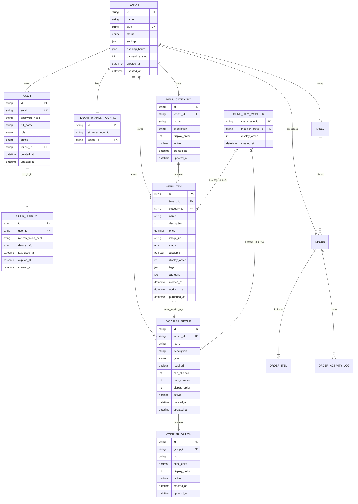

```mermaid
erDiagram
    %% --- IDENTITY & AUTH ---
    USER {
        string id PK
        string email UK
        string password_hash
        string full_name
        enum role
        enum status
        string tenant_id FK
        datetime created_at
        datetime updated_at
    }

    USER_SESSION {
        string id PK
        string user_id FK
        string refresh_token_hash
        string device_info
        datetime last_used_at
        datetime expires_at
        datetime created_at
    }

    TENANT {
        string id PK
        string name
        string slug UK
        enum status
        json settings
        json opening_hours
        int onboarding_step
        datetime created_at
        datetime updated_at
    }

    TENANT_PAYMENT_CONFIG {
        string id PK
        string stripe_account_id
        string tenant_id FK
    }

    MENU_CATEGORY {
        string id PK
        string tenant_id FK
        string name
        string description
        int display_order
        boolean active
        datetime created_at
        datetime updated_at
    }

    MENU_ITEM {
        string id PK
        string tenant_id FK
        string category_id FK
        string name
        string description
        decimal price
        string image_url
        enum status
        boolean available
        int display_order
        json tags
        json allergens
        datetime created_at
        datetime updated_at
        datetime published_at
    }

    MODIFIER_GROUP {
        string id PK
        string tenant_id FK
        string name
        string description
        enum type
        boolean required
        int min_choices
        int max_choices
        int display_order
        boolean active
        datetime created_at
        datetime updated_at
    }

    MODIFIER_OPTION {
        string id PK
        string group_id FK
        string name
        decimal price_delta
        int display_order
        boolean active
        datetime created_at
        datetime updated_at
    }

    MENU_ITEM_MODIFIER {
        string menu_item_id FK
        string modifier_group_id FK
        int display_order
        datetime created_at
    }

    %% RELATIONS
    TENANT ||--|{ USER : owns
    TENANT ||--|| TENANT_PAYMENT_CONFIG : has
    USER ||--o{ USER_SESSION : has_login

    TENANT ||--|{ MENU_CATEGORY : owns
    TENANT ||--|{ MENU_ITEM : owns
    TENANT ||--|{ MODIFIER_GROUP : owns

    MENU_CATEGORY ||--|{ MENU_ITEM : contains
    MENU_ITEM }|--|{ MODIFIER_GROUP : uses_implicit_n_n
    MODIFIER_GROUP ||--|{ MODIFIER_OPTION : contains
    MENU_ITEM_MODIFIER }|--|| MENU_ITEM : belongs_to_item
    MENU_ITEM_MODIFIER }|--|| MODIFIER_GROUP : belongs_to_group

    %% Các bảng khác (ORDER, TABLE, ORDER_ITEM, ORDER_ACTIVITY_LOG...) chưa điền thuộc tính
    TENANT ||--|{ TABLE : owns
    TENANT ||--|{ ORDER : processes
    TABLE ||--o{ ORDER : places
    ORDER ||--|{ ORDER_ITEM : includes
    ORDER ||--o{ ORDER_ACTIVITY_LOG : tracks
```