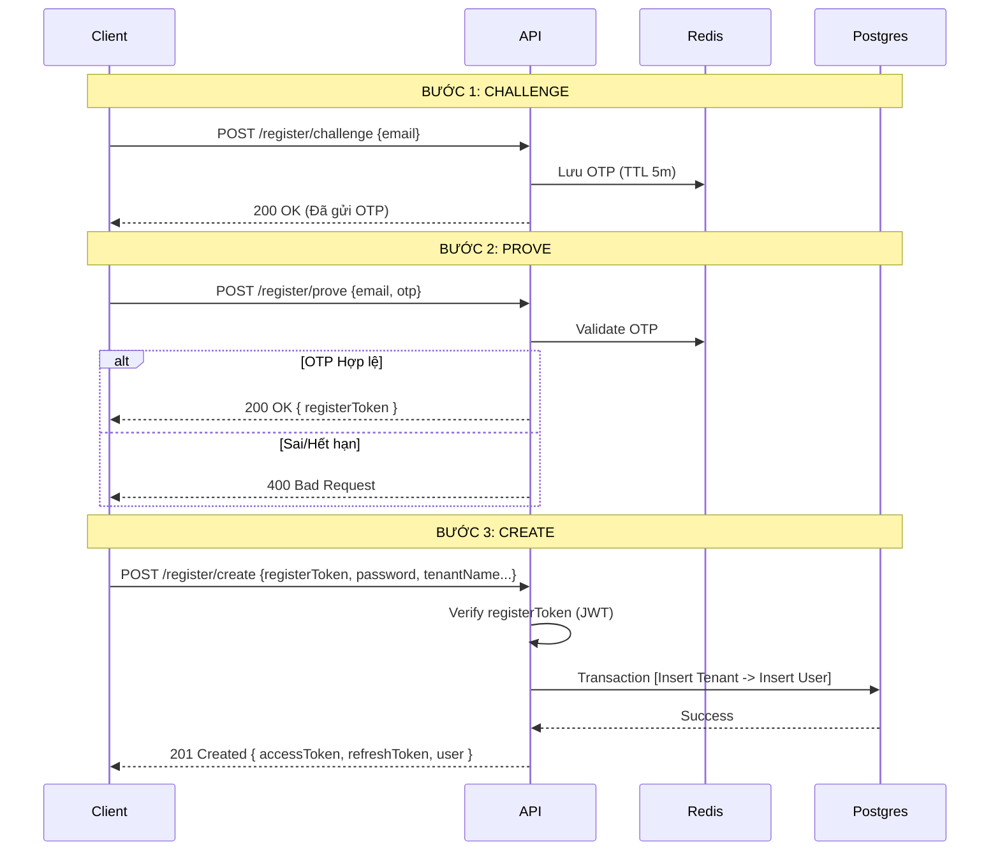
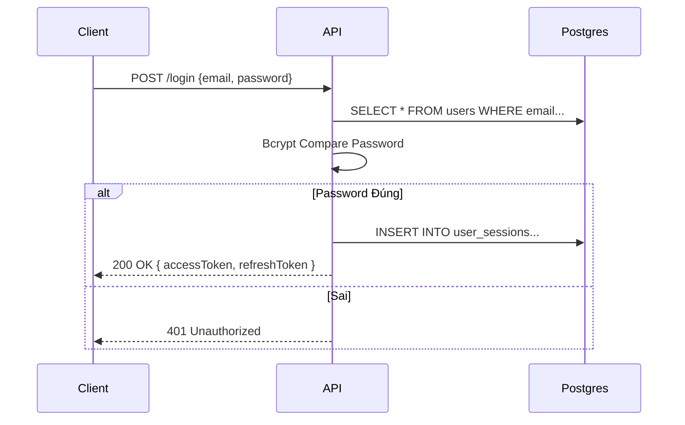

# API Specification — Epic 1: Auth & Onboarding

- **Version**: 1.0.0
- **Scope**: Authentication, Registration (Challenge-Prove-Create), Session Management.
- **Base URL**: `/api/v1/auth`

## 1. Sequence Diagrams (Luồng xử lý)

Để bạn dễ hình dung cách dữ liệu di chuyển giữa Client, Server (API), Redis và Database (Postgres), hãy xem hai sơ đồ sau:

### 1.1. Luồng Đăng ký (3 Bước)



### 1.2. Luồng Đăng nhập (Login)



---

## 2. API Endpoints Detail

### 2.1. Registration Group (Quy trình 3 bước)

### Step 1: Challenge (Gửi OTP)

Gửi yêu cầu xác thực email. Chưa chạm vào Postgres.

- **Endpoint**: `POST /register/challenge`
- **Request Body**:
    
    ```json
    {
      "email": "owner@restaurant.com"
    }
    ```
    
- **Logic Backend**:
    1. Validate format email.
    2. (Optional) Check Postgres: Nếu email đã tồn tại trong bảng `USER`, trả lỗi `409 Conflict` (hoặc thông báo giả để bảo mật).
    3. Generate 6-digit OTP.
    4. Lưu Redis: Key=`auth:otp:{email}`, Value=`{otp}`, TTL=`300s`.
    5. Gửi email chứa OTP.
- **Response**: `200 OK`
    
    ```json
    {
      "message": "OTP has been sent to your email."
    }
    ```
    

### Step 2: Prove (Xác thực OTP)

Kiểm tra OTP và cấp "giấy thông hành" tạm thời (`registerToken`).

- **Endpoint**: `POST /register/prove`
- **Request Body**:
    
    ```json
    {
      "email": "owner@restaurant.com",
      "otp": "123456"
    }
    ```
    
- **Logic Backend**:
    1. Lấy OTP từ Redis theo email.
    2. So khớp OTP gửi lên.
    3. Nếu đúng: Tạo JWT ngắn hạn (5-10 phút).
        
        Payload: `{ "email": "...", "email_verified": true, "scope": "registration" }`
        
    4. Xóa OTP trong Redis.
- **Response**: `200 OK`
    
    ```json
    {
      "registerToken": "eyJhbGciOiJIUzI1NiIsInR5cCI6IkpXVCJ9..."
    }
    ```
    

### Step 3: Create (Khởi tạo Tenant & User)

Bước quan trọng nhất, ghi dữ liệu vào Postgres.

- **Endpoint**: `POST /register/create`
- **Request Body**:
    
    ```json
    {
      "registerToken": "eyJhbGciOiJIUzI1Ni...", // Lấy từ bước 2
      "fullName": "Nguyen Van A",
      "password": "StrongPassword123!",
      "tenantName": "Pho Ngon 123",
      "slug": "pho-ngon-123" // Optional, nếu không có backend tự gen từ name
    }
    ```
    
- **Logic Backend**:
    1. Verify `registerToken`. Lấy `email` từ payload token.
    2. **Database Transaction (Atomicity)**:
        - Insert **TENANT**: `name`, `slug`, `status='ACTIVE'`, `onboarding_step=1`.
        - Insert **USER**: `email` (từ token), `password_hash` (bcrypt), `role='OWNER'`, `tenant_id` (vừa tạo).
        - Insert **USER_SESSION**: Tạo session đầu tiên.
    3. Generate cặp token Auth (`accessToken`, `refreshToken`).
- **Response**: `201 Created`
    
    ```json
    {
      "accessToken": "eyJ...",
      "refreshToken": "eyJ...",
      "user": {
        "id": "uuid-...",
        "email": "owner@restaurant.com",
        "fullName": "Nguyen Van A",
        "role": "OWNER",
        "tenantId": "uuid-tenant-..."
      },
      "tenant": {
        "id": "uuid-tenant-...",
        "name": "Pho Ngon 123",
        "slug": "pho-ngon-123"
      }
    }
    ```
    

---

### 2.2. Authentication Group (Đăng nhập & Session)

### Login (Đăng nhập thường)

Dành cho người dùng đã có tài khoản (lần thứ 2 trở đi).

- **Endpoint**: `POST /login`
- **Request Body**:
    
    ```json
    {
      "email": "owner@restaurant.com",
      "password": "StrongPassword123!",
      "deviceInfo": "Chrome 120 on MacOS" // FE có lấy được hong?
    }
    ```
    
- **Logic Backend**:
    1. Query `USER` table theo email.
    2. `bcrypt.compare(password, user.password_hash)`.
    3. Nếu khớp:
        - Generate `accessToken` (15p-1h) & `refreshToken` (7-30 ngày).
        - Hash `refreshToken`.
        - Insert **USER_SESSION**: `user_id`, `refresh_token_hash`, `device_info`, `expires_at`.
- **Response**: `200 OK`
    
    ```json
    {
      "accessToken": "eyJ...",
      "refreshToken": "eyJ...", // Client cần lưu cái này Securely (HttpOnly Cookie hoặc Secure Storage)
      "user": { ... } // Giống response register
    }
    ```
    

### Refresh Token (Làm mới phiên)

Khi `accessToken` hết hạn, dùng API này để lấy cái mới mà không cần đăng nhập lại.

- **Endpoint**: `POST /refresh`
- **Request Body**:
    
    ```json
    {
      "refreshToken": "eyJ..."
    }
    ```
    
- **Logic Backend**:
    1. Verify `refreshToken` (signature & expiration).
    2. Hash `refreshToken` gửi lên.
    3. Query **USER_SESSION**: Tìm session có `refresh_token_hash` tương ứng và chưa hết hạn (`expires_at`).
    4. (Optional Security - Rotation): Xóa session cũ, tạo session mới hoặc update hash mới.
    5. Cấp `accessToken` mới.
- **Response**: `200 OK`
    
    ```json
    {
      "accessToken": "eyJ_new_access_token..."
    }
    ```
    

### Logout (Đăng xuất)

Hủy phiên làm việc.

- **Endpoint**: `POST /logout`
- **Authorization**: Bearer `<accessToken>`
- **Request Body**:
    
    ```json
    {
      "refreshToken": "eyJ..." // Token cần revoke
    }
    ```
    
- **Logic Backend**:
    1. Tìm và xóa record trong bảng **USER_SESSION** dựa trên hash của `refreshToken`.
- **Response**: `204 No Content`

### Get Current User (Me)

Lấy thông tin profile và tenant hiện tại.

- **Endpoint**: `GET /me`
- **Authorization**: Bearer `<accessToken>`
- **Logic Backend**:
    1. Lấy `userId` từ token claims.
    2. Join bảng `USER` và `TENANT`.
- **Response**: `200 OK`
    
    ```json
    {
      "user": {
        "id": "...",
        "email": "...",
        "role": "OWNER"
      },
      "tenant": {
        "id": "...",
        "name": "...",
        "status": "ACTIVE",
        "onboardingStep": 1
      }
    }
    ```
    

---

## 3. Data Schema & Validation Rules

Đây là các quy tắc validation bạn cần cài đặt ở tầng DTO (Data Transfer Object) trước khi xử lý logic:

| **Field** | **Type** | **Validation Rules** | **Note** |
| --- | --- | --- | --- |
| **Email** | String | Valid email format | Normalize về lowercase trước khi xử lý |
| **Password** | String | Min 8 chars, ít nhất 1 số, 1 ký tự đặc biệt | Bảo mật cơ bản |
| **OTP** | String | Length = 6, Numeric only |  |
| **Tenant Name** | String | Min 3, Max 50 chars |  |
| **Slug** | String | Regex `^[a-z0-9-]+$`, Unique | Nếu user nhập tay phải validate |

## 4. Ghi chú cho Developer

1. **JWT Strategy**:
    - `RegisterToken`: Chỉ dùng để đăng ký, lifetime ngắn (5-10p). Secret key nên khác với AccessToken.
    - `AccessToken`: Stateless, chứa đủ info để authorize (`role`, `tenantId`).
    - `RefreshToken`: Stateful (lưu hash trong DB `USER_SESSION`), dùng để revoke quyền truy cập.
2. **Database Indexing**:
    - Bảng `USER`: Index `email`.
    - Bảng `USER_SESSION`: Index `refresh_token_hash` (để query nhanh khi refresh), Index `user_id` (để query các thiết bị đang đăng nhập).
    - Bảng `TENANT`: Index `slug`.
3. **Security**:
    - Mật khẩu **không bao giờ** được trả về trong bất kỳ Response nào.
    - `USER_SESSION` lưu `refresh_token_hash`, **không lưu plain text token**. Nếu database bị lộ, hacker cũng không thể dùng hash đó để generate access token mới (vì cần secret key của server để verify signature trước).